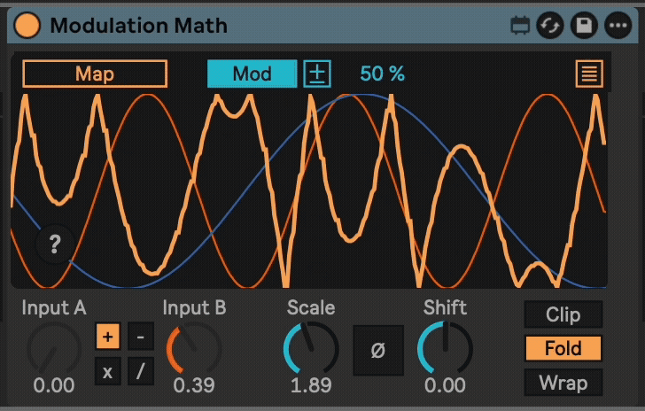

# Modulation Math

This is a Max For Live device that lets you combine two modulation signals using math. This allows you to have more complex modulation than what you can normally do in Ableton Live.

For example, two sine-wave LFOs running at different speeds whose values are added together will produce a complex wave. Another example is to use an LFO for vibrato, but manually control a second offset with a MIDI controller.

You can add, subtract, multiply, and divide two input signals. From there, you can invert, scale, and shift the resulting signal and map it to any other parameter (up to 8 destinations).

Here is an image Modulation Math multiplying the signals of a Shaper (mapped to Input A) and an LFO (mapped to Input B).

## Installation

[Download the newest .amxd file from the frozen/ directory](https://github.com/zsteinkamp/m4l-Modulation-Math/raw/main/frozen/) or clone this repository, and drag the `Modulation Math.amxd` device into a track in Ableton Live.

## Changelog

* 2022-12-05 [v7](https://github.com/zsteinkamp/m4l-Modulation-Math/raw/main/frozen/Modulation%20Math%20v7.amxd) - Support Live 12's new modulation mode, visual improvements.
* 2022-12-05 [v6](https://github.com/zsteinkamp/m4l-Modulation-Math/raw/main/frozen/Modulation%20Math%20v6.amxd) - Rename to 'Modulation Math', use integer version numbers.
* 2022-05-16 [0.0.5](https://github.com/zsteinkamp/m4l-Modulation-Math/raw/main/frozen/AutomationMath-0.0.5.amxd) - Configure the `live.banks` object for Push2 knob assignments.
* 2022-04-27 [0.0.4](https://github.com/zsteinkamp/m4l-Modulation-Math/raw/main/frozen/AutomationMath-0.0.4.amxd) - Add multiple mapping destinations.  (thanks AYA)
* 2022-04-26 [0.0.3](https://github.com/zsteinkamp/m4l-Modulation-Math/raw/main/frozen/AutomationMath-0.0.3.amxd) - Fix bug with multiple instances. (thanks Spin)
* 2022-04-09 [0.0.2](https://github.com/zsteinkamp/m4l-Modulation-Math/raw/main/frozen/AutomationMath-0.0.2.amxd) - Change layout to match LFO device.
* 2022-04-08 [0.0.1](https://github.com/zsteinkamp/m4l-Modulation-Math/raw/main/frozen/AutomationMath-0.0.1.amxd) - Initial release.

## Usage

Usually, you would map a MIDI controller or modulation source to `Input A` and `Input B`. Choose an operator, and then map the output to some other parameter. The example above shows it mapped to the Auto Filter Frequency.

The scale and shift knobs operate on the output signal, in that order.

The invert toggle (Ø) will flip the output signal, so 0 becomes 1, and 1 becomes 0.

## Attention to Detail

* Works with any well designed theme.
* Good Push / Push2 integration.
* Fully automatable, with sensible and consistent parameter names.

## TODO

* ...

## Contributing

I'd love it if others extended this device. If you would like to contribute, simply fork this repo, make your changes, and open a pull request and I'll have a look.
